Présentation
===

Le Plugin MyModBus sert à communiquer en protocole Modbus via plusieurs types de Liaison.

	- Liaison modbus Ethernet
	- Liaison Série Mode RTU ( A venir )

Il est compatible avec plusieurs types d’automates (Crouzet, IPX  , Wago …)

Configuration du plugin
===

Après téléchargement du plugin, il vous suffit juste d’activer et d’installer les dépendances Mymodbus (clic sur le bouton Installer/Mettre à jour)

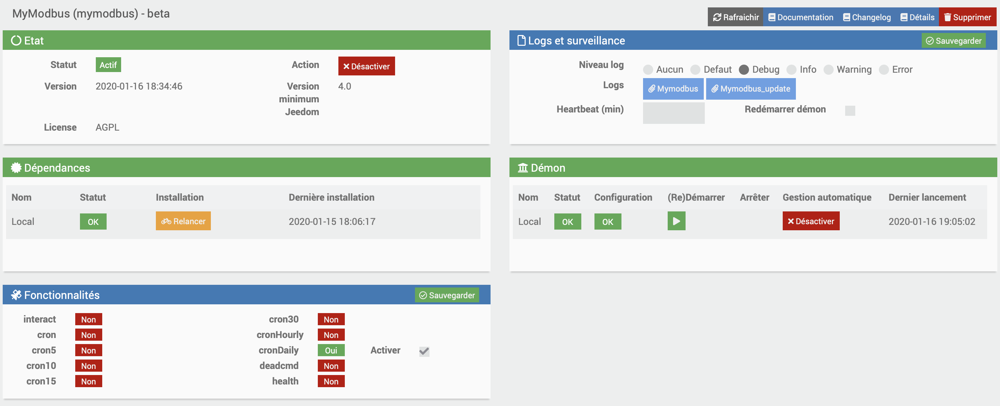

Création d'un équipement 
===

- Avant de démarrer le demon , il faut commencer par créer un équipement modbus :

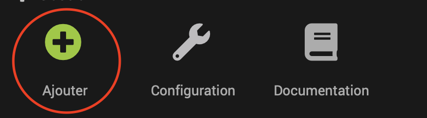

Configuration d'un équipement  .
===

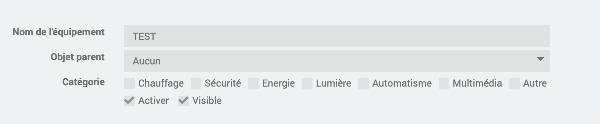

Vous retrouvez ici toute la configuration de votre équipement :

	Nom de l’équipement Mymodbus : nom de votre équipement Mymodbus,

	Objet parent : indique l’objet parent auquel appartient l’équipement,

	Catégorie : les catégories de l’équipement (il peut appartenir à plusieurs catégories),

	Activer : permet de rendre votre équipement actif,

	Visible : rend votre équipement visible sur le dashboard,

En-dessous vous retrouvez la liste des commandes :

	Nom : le nom affiché sur le dashboard,

	Afficher : permet d’afficher la donnée sur le dashboard,

	Tester : permet de tester la commande
	

Exemple de configuration pour un automate Crouzet
===

- Ajout d’un équipement de type Crouzet_M3

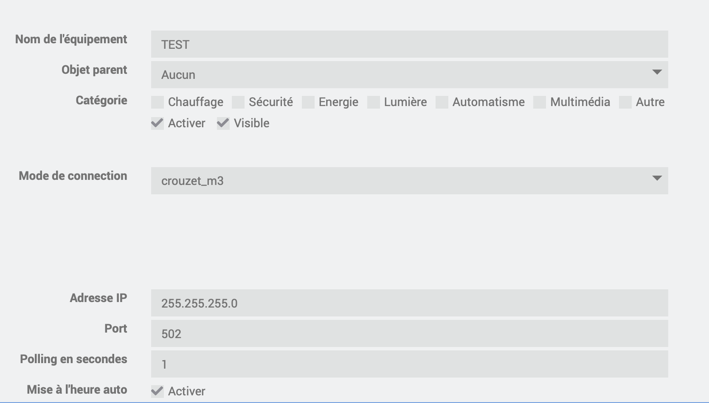

- Une fois la configuration renseigner on passe à l’ajout des commandes par exemple celle de type "info" : 

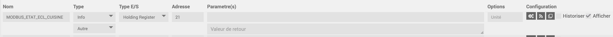

- Puis les commandes de type actions :

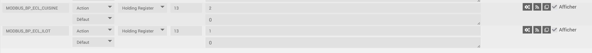

- Une fois cliqué sur sauvegarder le démon va démarrer automatiquement et les commandes seront opérationnelles 

Petit plus :) : 

	- Jeedom recherche toutes les jours à 00h30 s’il y a un automate à mettre à l’heure , si oui il le fait .

Création d'un virtuel
===

Pour se faire vous devez obligatoirement avoir installé le plugin “virtuel” 

Il faut maintenant créer les commandes du virtuel pour cela on s’appuie sur celles crées précédemment dans le plugin MyModbus:

- La commande info : 

	- #[Cuisine][Cuisine][MODBUS_ETAT_ECL_CUISINE]# &2 // Cette commande info nous permet de récupérer l’état sur le bit n°2

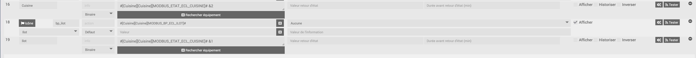

- Puis la commande action :

	- #[Cuisine][Cuisine][MODBUS_BP_ECL_CUISINE]# 

Filtre pour un octet :
---------------------- 

Vous trouverez ci dessous un exemple de virtuel pour extraire le premier octet d'un registre :
- Partie configuration :
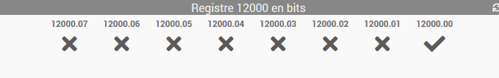
- Voilà ce que ca donne dans l'ordre :
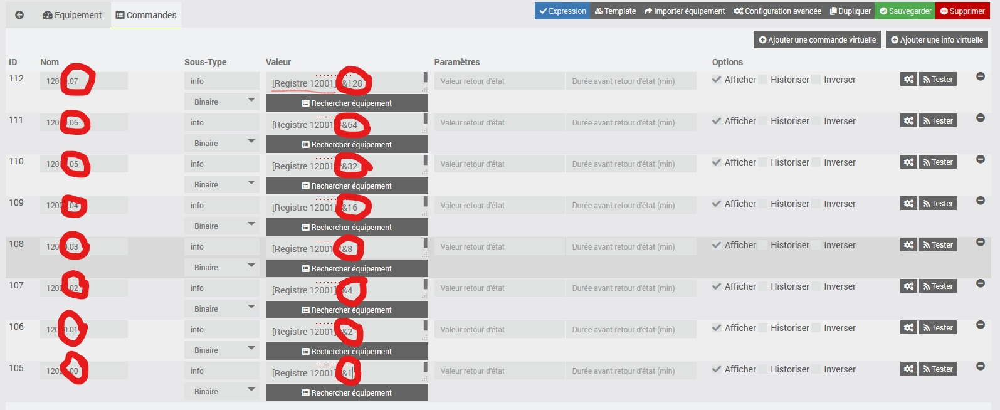

Configuration d'un WAGO
===

Dans cette partie, je vais parler de la configuration du plugin pour un automate WAGO 750-x

L'adressage :
-------------
Petite explication sur l'adressage WAGO. Nous ne parlerons ici que des Entrées %I, des Sorties %Q et des mémoires %M
Chacune de ces adresses peut être lue et/ou écrite sous forme de bit (0 ou 1) ou de mot (16 bits = de 0 à 65535)

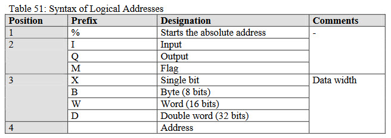

Dans ce document, vous voyez d'autres informations, comme des Byte ou Double word, mais ça ne sera pas utilisé pour le ModBus. Nous utilisons donc les I, Q et M, ainsi que les X et W.

Exemple, pour la première entrée, on peut avoir soit %IW0 (16 bits) soit %IX0.0, %IX0.1, ... , %IX0.15 (soit les 16 bits du mot, mais adressable un par un)

- Parlons modbus, nous avons dans le module 2 "data type":

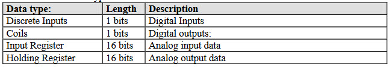

Pour le moment, je n'ai pas trouvé la différence entre Input Register et Holding Register, ni entre Coils et Discrete Imputs, et j'ai réussi à tout faire avec Coils et Holding Register, donc je ne parlerais que de ces 2 types.

- Comment trouver les adresses ModBus correspondant aux %I, %Q, %M ? 

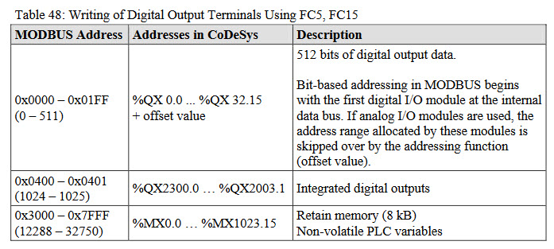

Donc pour simplifier : 
- %IX0.0 -> %IX31.15 ont les adresses 0 à 511
- %MX0.0 -> %MX1279.15 ont les adresses de 12888 à 32750
Je ne parle pas des %QX car c'est un peu particulier et j'en parle après.

- Et les Sorties alors ? 
Maintenant ça va devenir plus compliqué, on va parler des mots et meme si les mots permettent de lire les mmêmes informations, les adresses sont différentes.
Par exemple, si je veux QX0.3, ça correspond au 4è bit sur mot de sortie 0, soit %QW0 bit 3.

J'espère que vous avez suivi, car avec le modbus, on ne peut pas lire un %QX, on doit lire un %QW et ensuite séparer chaque bit dans un virtuel comme indiqué plus haut dans cette documentation.

Et pour couronner le tout, %QW0 a l'adresse 512, %QW1 a l'adresse 513, ... 

Bon allez, pour vous simplifier la tâche, j'ai créé un document excel pour les premières adresses, vous le trouverez : 
[ici](https://github.com/Bebel27A/jeedom-mymobdus.github.io/blob/master/fr_FR/WAGO_adressage.xlsx)

- **Voilà, maintenant vous connaissez l'adressage, on va entrer dans le vif du sujet**

Configuration :
---------------
Nous avons donc notre Jeedom, notre Wago, ils communiquent via le plugin. Parfait !
On peux maintenant faire 3 choses : 
- récupérer l'état des entrées %IX et %IW
- récupérer l'état des sorties %QW (et via des virtuels les %QX)
- lire et écrire dans des registres mémoire (%MX ou %MW)

Ne pensez pas que vous pourrez directement écrire sur une sortie pour allumer une lampe, ça ne fonctionnera pas, il faut que ce soit l'automate qui active l'entrée.
**Donc les entrées et sorties sont en fait en lecture seules** (je peux me tromper car je n'ai pas fait trop de tests, mais de toute façon, pour éviter les soucis c'est nettement mieux de faire comme ça)

- Rapidement, voici comment lire les informations via jeedom
Pour lire %IX0.0 : 

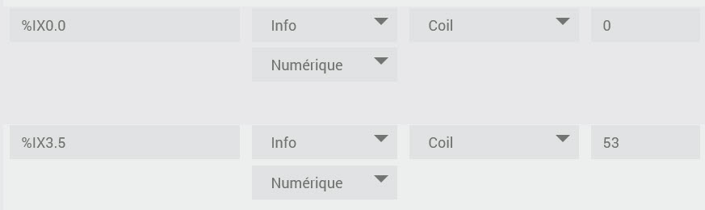

Pour les %QW : 

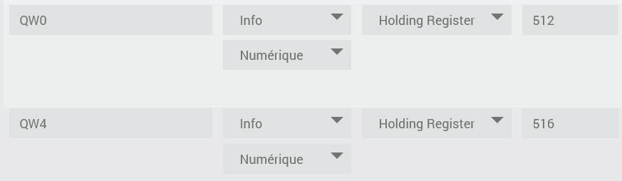

Et pour écrire les %MX (le principe est le même pour les MW)

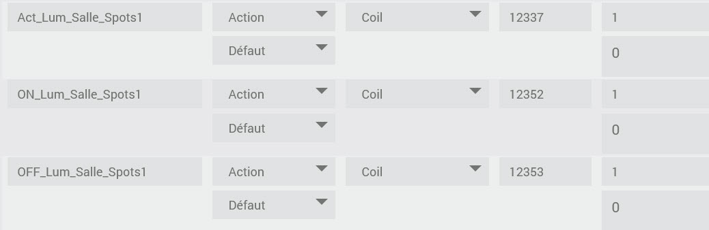

- Voilà, avec ça vous pouvez lire les entrées & sorties, ainsi qu'écrire les MX
Quelques explications sur mes MX, ici j'ai voulu tester 3 fonctions avec la lampe de test que j'ai a côté de moi.
1. Simuler l'appuis sur l'interrupteur
1. Forcer l'extinction
1. Forcer l'allumage

- Par contre, vous vous en doutez, ça ne suffit pas, ici on met juste les variables suivantes à 1 puis 0 (simuler un appuis sur interrupteur virtuel)
1. Addr 12337 -> %MX3.4  (pour simuler l'appuis sur l'interrupteur de la pièce)
1. Addr 12352 -> %MX4.0  (pour forcer l'allumage de la lampe Spots1)
1. Addr 12353 -> %MX4.1  (pour forcer l'extinction)

- Il faut maintenant adapter le programme de l'automate dans CodeSys

*Première chose à faire:* déclarer les %MX en tant que variables.
Pour celà, dans Resources/Global variables je crée un nouveau fichiers de variables que j'ai appelé Variables_virtuelles

- Dedans, il faut déclarer tous les %MX et %MW utilisé : 
vrt_LUM_Salle_Spots1 AT %MX3.1 : BOOL;

> **Tip**
>
>Pour vous aider, dans le fichier excel, vous trouverez un 4è onglet, qui crée directement les syntaxes, plus qu'à copier-coller ou adapter.

Voilà, nous avons maintenant des *interrupteurs* virtuels appelé vrt_LUM_Salle_Sports1 dans mon exemple. On peut donc l'utiliser dans le code.

- Dans l'exemple qui suit, je parle de la config chez moi, donc il faut l'adpater pour vous. 
Je code en ST dans CodeSys, donc désolé pour ceux qui préfère le Ladder ou autre

	(* Salle *)
	        (*  Virtuels  *)
			vrt_temp_salle_spots1 := FALSE;
			IF (vrt_LUM_Salle_Spots1_On) THEN
				IF (NOT LUM_Salle_Spots1) THEN
					vrt_temp_salle_spots1:=TRUE;
				END_IF
			END_IF
			IF (vrt_LUM_Salle_Spots1_Off) THEN
				IF (LUM_Salle_Spots1) THEN
					vrt_temp_salle_spots1:=TRUE;
				END_IF
			END_IF
		
	input_Lum_Salle_Spots1:=simple_INT_Salle_TV_1 OR simple_INT_Salle_Esc_Lum_G OR simple_INT_Coul_Chaud_1 OR simple_INT_Salle_Ecran_Lum_G OR simple_INT_Salle_Cuis_G OR vrt_LUM_Salle_Spots1 OR vrt_temp_salle_spots1;

	SW_LUM_Salle_Spots1(Interrupteur:=input_Lum_Salle_Spots1); LUM_Salle_Spots1:=SW_LUM_Salle_Spots1.Lampe;
	

Un peu d'explications : ma sortie physique s'appelle LUM_Salle_Spots1 (elle est assigné dans la configuration physique de l'automate dans CodeSys).
Maintenant, je vais prendre le code à l'envers pour une meilleure compréhension :

SW_LUM_Salle_Spots1 est un switch, en gros ça inverse juste l'état si l'`Interrupteur` en paramètre est à TRUE.
Et ma sortie LUM_Salle_Spots1 est donc positionné sur la sortie `Lampe`de ce switch.

Ensuite la variable input_Lum_Salle_Sports1, c'est en fait mon `Interrupteur` dont on a parlé plus haut, mais comme j'ai dans la pièce plusieurs interrupteurs physiques, plus des interrupteurs virtuels, je fais juste un simple `OR` avec tous ces interrupteurs.
*(pour ceux qui sont intrigué, j'ai simple_ pour un simple click, double_ pour un double click, triple_ pour un triple click et long_ pour un appuis long, mais ça n'a rien à voir avec le sujet)*

Dans cette chaine de `OR`, vous trouvez à la fin 2 virtuels : 
* vrt_LUM_Salle_Spots1 : qui est le %MX3.4 dont on a parlé plus haut
* vrt_temp_salle_spots1 : qui est une variable locale à ce programme qui est initialisé juste au dessus et que j'explique juste après.

A quoi servent ces 2 virtuels : 
* vrt_LUM_Salle_Spots1 sert à simuler un simple appuis sur l'interrupteur, donc même fonctionnement qu'un interrupteur physique.
* vrt_temp_salle_spots1 permet de traiter le ON et le OFF pour forcer l'allumage ou l'extinction.

Comment fonctionne le ON et le OFF
Ca se fait dans le premier bout de code 

	(*  Virtuels  *)
	vrt_temp_salle_spots1 := FALSE;
	IF (vrt_LUM_Salle_Spots1_On) THEN
   	   IF (NOT LUM_Salle_Spots1) THEN
      	      vrt_temp_salle_spots1:=TRUE;
   	   END_IF
	END_IF
	
	IF (vrt_LUM_Salle_Spots1_Off) THEN
   	   IF (LUM_Salle_Spots1) THEN
      	      vrt_temp_salle_spots1:=TRUE;
   	   END_IF
	END_IF

En gros, si on veut faire un ON, on doit juste faire quelque chose si la lumière est éteinte, et dans ce cas on simule un appuis sur l'interrupteur temp.

Idem pour le OFF, on ne doit faire quelquechose que si la lumière est allumée, et dans ce cas c'est aussi une simulation d'appuis sur l'interrupteur temp.

Voilà, vous savez tout maintenant sur la configuration de MyModBus pour les automates WAGO.

(Cette partie sur WAGO a été faite par Vincent VAURETTE @vvaurette)

FAQ
===

Merci à @Anthony_Ferreira pour ce début de documentation sur les automates Crouzet.

Merci à @vvaurette pour la partie de documention sur le Wago.