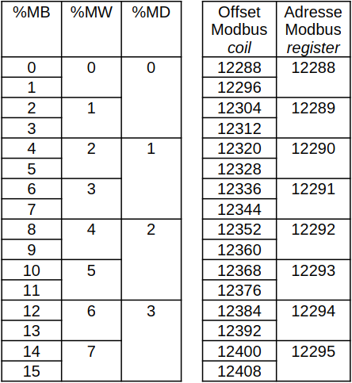
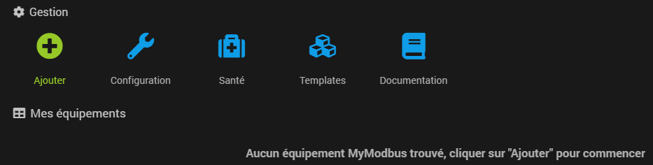
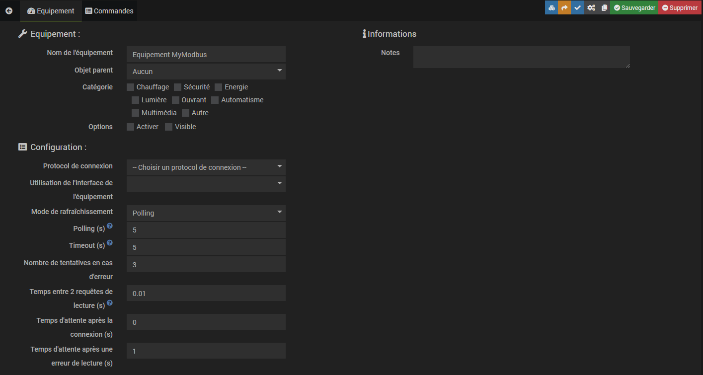
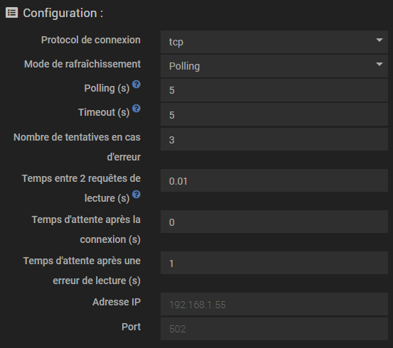
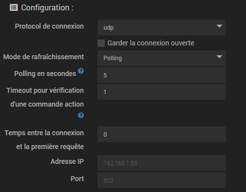
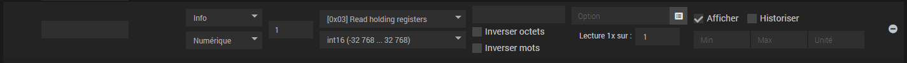
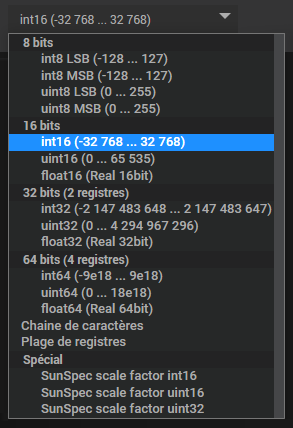

# Présentation

Le plugin MyModBus permet d'intégrer des communications Modbus dans Jeedom. MyModbus est un client Modbus capable
de communiquer en :
- Ethernet TCP standard ou RTU
- Ethernet UDP
- Série en mode binaire, ASCII ou RTU

Il est compatible avec plusieurs types d’appareil (automate, chaudière, VMC, redresseur, …).

## Modbus ?

Un serveur Modbus est un appareil qui met à disposition des registres en lecture et/ou en écriture. Il existe des
registres binaires de un bit et des registres numériques de 16 bits.

Initialement prévu pour la communication avec les automates Modicon(R), le prorocol Modbus permet d'effectuer un
certain nombre de requêtes de lecture ou d'écriture dans des zones mémoire différentes :
- la zone des entrées : en lecture seule (on ne peut pas réécrire l'état d'une entrée automate)
- la zone des sorties et de la mémoire interne : en lecture/écriture

C'est la raison pour laquelle les requêtes ont des noms standards qui font référence à ces zones : read discrete
inputs, write coil, read input registers, read holding registers, par exemple.

Chaque fonction de lecture ou d'écriture, qu'on appelle requête, est destinée au traitement d'un seul type d'échange
et a un code de fonction : une valeur numérique codée sur un ou deux octets.  
Le protocole Modbus est basé sur une norme qui ne sera pas détaillée ici. Vous pouvez consulter le
[site officiel](https://modbus.org/specs.php) (cliquez sur "I ACCEPT").

## Organisation de la mémoire

Dans tout appareil équipé de mémoire, celle-ci est organisées par adresses. Les adresses de registres accessibles
via Modbus sont organisées de sorte de se succéder dans différentes partie de la zone mémoire.  
Il faut s'imaginer les registres, les uns à la suite des autres, comme des "cases mémoire" bien rangées.

Par exemple, pour la zone mémoire de la mémoire interne des automates Wago, les premières adresses sont organisées
comme ceci :  

Dans ce cas, c'est un peu particulier, parce que les bits (%MW0.5, par exemple) sont dans la même plage mémoire que
les registres avec une plage d'adresse Modbus commune. Donc la fonction read_coils à l'adresse 12295 lira %MW0.7 tandis
que la fonction read_holding_registers à la même adresse Modbus (12295) lira %MW7.  
C'est une gymnastique qu'il faut essayer d'apprendre, mais tous les appareils ne sont pas gérés de la même manière.

***

# Installation de MyModbus

L'installation se fait via le market, comme tous les plugins Jeedom. Une fois téléchargé, MyModbus installe ses
dépendances, cette étape peut durer plusieurs dizaines de minutes en fonction de la bande passante disponible et
des capacités de votre machine.  
Il est fortement conseillé de désactiver la gestion automatique du démon durant l'installation afin que le démon
ne soit pas démarré par Jeedom sans que MyModbus ne soit installé complètement.

Ici, on peut constater que l'installation de MyModbus sur un Raspberry PI 3B peut durer vraiment longtemps :  

Une fois l'installation terminée, la page de gestion du plugin MyModbus ressemblera à ceci :  

Vous pouvez activer la gestion automatique du démon par Jeedom si vous le souhaitez.

MyModbus lance un démon écrit en Python qui utilise le module [pymodbus](https://pypi.org/project/pymodbus/).  
Dans la documentation de pymodbus, on peut voir que la version minimale requise pour pouvoir l'utiliser est
Python >= 3.8, ne vous inquiétez pas, ce point est géré quel que soit la version installée sur votre machine Jeedom.

***

# Configuration de MyModbus

## Le principe

Pour chaque appareil avec lequel vous souhaitez communiquer en Modbus, il faudra créer un équipement. Cet équipement
contiendra autant de commandes info ou action que vous avez de variables à lire ou à écrire. Les principes de Jeedom
sont respectés.

Pour chaque équipement, il faut préciser le type de connexion ainsi que les paramètres de cette connexion.

Pour chaque commande, il faut préciser les type et sous-type Jeedom ainsi que les paramètres de la requête Modbus.

Le fait de sauvegarder la configuration lance une validation. Si la configuration est valide, la configuration du
démon est actualisée.  
Si au moins 2 équipements série sont configurés pour communiquer avec la même interface série, MyModbus génèrera une
erreur et la configuration ne sera pas sauvegardée.

La configuration se fait via Plugins / Protocole domotique / MyModbus :  

## Création d'un équipement 

C'est la première étape. Sans équipement, le démon n'est pas démarré. Après l'installation, la configuration est vide :  

En cliquant sur "Ajouter", vous êtes invité à donner le nom de votre équipement. Pour la documentation, ce nom sera
"Equipement MyModbus". En validant, vous arrivez à la page de configuration de l'équipement. Juste après sa création,
l'équipement n'est pas configuré :  

## Configuration d'un équipement

La page de configuration se compose de trois parties :
- **Equipement** : cette partie est pratiquement la même pour tous les équipements des plugins de Jeedom.
Le fait d'activer l'équipement activera le démon pour les commandes de cet équipement, après enregistrement de la
configuration.
- **Configuration** : c'est là que vous configurez la connexion avec votre équipement.
- **Informations** : vous pouvez ajouter vos propres notes afin de documenter votre équipement.

MyModbus gère trois protocoles de connexion .
- Série : à choisir pour un équipement communiquant via une liaison série (RS232, RS485, RS422, ...) **directement**
avec votre machine Jeedom. Un seul équipement est défini dans MyModbus pour chaque interface série, même si plusieurs
esclaves se trouvent sur le bus série. L'adresse de l'esclave est à renseigner dans les commandes.
- TCP
- UDP

> :warning: ***Important***  
> Si vous avez des appareils Modbus reliés à une paserelle IP/série et que votre machine Jeedom communique avec la
> passerelle, il faudra choisir une liaison TCP (ou UDP) et configurer la liaison vers la passerelle.

L'option "Garder la connexion ouverte" est commune à tous les protocoles de connexion et permet de ne pas activement
fermer la connexion entre les cycles de requêtes. Ce paramètre est propre à votre installation et à votre configuration.
Il se peut qu'il faille activer ou désactiver cette option en fonction de votre installation et du polling (temps de
raffraisissement).

Le polling est un temps en secondes qui correspond au temps entre le début des cycles de lecture des commandes info.
Les écritures déclenchées par les commandes action sont effectuées durant ce même cycle, après les lectures.  
La valeur minimale de polling acceptée par MyModbus est 10 secondes. Une valeur conseillée serait de l'ordre de la
minute, soit 60 secondes. Un polling bas, c'est-à-dire des lectures très fréquentes, induit une grande quantité de
données à historiser. Prenez garde à ce point et gardez en tête que l'enregistrement des valeurs toutes les 10
secondes ne génère que du bruit sur une courbe journalière ou hebdomadaire.

> A titre d'exemple un automate Wago avec un polling supérieur à 30 secondes ne supporte pas de garder la connexion
> ouverte et génère des erreurs lors de l'exécution des requêtes. 

Le "Temps entre la connexion et la première requête" peut être mis à 0 si le paramètre peut être ignoré. Pour
certains appareils, il faut configurer une pause entre la connexion et la première requête. Pour l'onduleur SUN2000
de Huawei, par exemple, ce temps est à configurer à 1 seconde.

### Cas d'une connexion série

Une connexion série non configurée se présente comme ceci :  

L'interface correspond au point de connexion de la liaison série sur votre machine Jeedom. Jeedom propose une liste
d'interfaces standards en fonction du modèle de votre machine. En plus de ces interfaces. MyModbus propose les
interfaces série disponibles sur la machine. Les indications de
[cette page](https://www.baeldung.com/linux/all-serial-devices) peuvent vous être utiles pour retrouver quelle interface
utiliser.

> :memo: ***Remarque***  
> Il se peut que les interfaces proposées par MyModbus soient redondantes avec celles proposées par Jeedom et que
> la sélection soit différente une fois que vous avez sauvegardé et rechargé cette page. Ne vous inquiétez pas, cela
> signifie seulement que l'élément sélectionné pointe vers la même interface que celle que vous avez enregistrée, mais
> cette entrée apparaît avant l'entrée que vous avez selectionnée.

Les autres paramètres sont à aligner avec la configuration décrite dans la documentation constructeur de votre appareil.

Voici un exemple de configuration série :  

### Cas d'une connexion TCP

Une connexion TCP non configurée se présente comme ceci :  

Ici la configuration est simple : il suffit de renseigner l'adresse IP de l'appareil et le port à utiliser. Sauf cas
particulier, le port est le 502.

L'option RTU sur TCP permet d'activer le mode "RTU over TCP".

### Cas d'une connexion UDP

Une connexion UDP non configurée se présente comme ceci :  

Ici la configuration est également simple.

## Création et configuration des commandes

> :bulb: ***Conseil***  
> Il vous est conseillé d'enregistrer la configuration de MyModbus **sans activer l'équipement** avant de commencer le
> paramétrage des commandes. De cette manière, la configuration de la connexion sera sauvegardée mais Jeedom n'essaiera
> pas de démarrer le démon.

> :memo: ***Remarque***  
> Si vous utilisiez une ancienne version de MyModbus, la nouvelle version garde les commandes et vous "propose" une
> configuration équivalente. Il est cependant vivement conseillé de remplacer le type de variable 'uint16' associé au
> calcul qui permet de lire les valeurs négatives par le type de variable 'int16' sans calcul.  
> De manière générale, il vaut mieux revoir la configuration complète en détail.

Après la création d'un équipement, la liste des commandes est vide. Tant que cette liste sera vide, le démon ne pourra
pas être lancé et MyModbus génèrera une erreur si l'équipement est sauvegardé quand il est activé et que la liste des
commandes est vide.

Pour créer une nouvelle commande, il faut cliquer sur le bouton "Ajouter une commande". La nouvelle commande est ajoutée
à la fin de la liste et peut être déplacée avec un cliquer-déplacer.

Vous pouvez commencer par donner un nom à la commande et définir s'il s'agit d'une commande info ou action. Si une
commande n'a pas de nom, la configuration n'est pas enregistrée.

### Sous-type

Pour **les commandes info**, les trois sous-types proposés par Jeedom peuvent être utilisés :  

| Type de registre     | Sous-type   |
| -------------------- | ----------- |
| bit ou bit inversé   | Binaire     |
| int, uint ou float   | Numérique   |
| chaine de caractères | Autre       |

Pour **les commandes action**, les couleurs et les listes ne sont pas gérées par MyModbus :  

| Type de registre     | Sous-type        |
| -------------------- | ---------------- |
| bit ou bit inversé   | Défaut / curseur |
| int, uint ou float   | Défaut / curseur |
| chaine de caractères | Défaut / message |

### Adresse esclave

Si la commande correspond à un registre dans un esclave sur un bus série d'une connexion série directe ou derrière
une passerelle IP/série, vous devez renseigner l'adresse de l'esclave sur le bus Modbus. Sinon vous pouvez laisser "0".

### Fonction Modbus

Choisissez la fonction Modbus à utiliser pour la lecture ou l'écriture du registre. Normalement, la fonction à utiliser
est documentée par le constructeur. Si ce n'est pas le cas, faites appel à votre logique et faites des essais (bon
courage !).

> :memo: ***Remarque***  
> Seules les fonctions compatibles avec le type et le sous-type sont proposées. Attention donc à bien sélectionner la
> fonction de la commande après avoir modifié le type ou le sous-type. Si vous oubliez, la vérification au moment de
> l'enregistrement génèrera une erreur et invalidera la sauvegarde.

### Codage du registre et adresse Modbus

Pour comprendre cette partie, il faut un peu de théorie :  
> Les registres sont des mots de 16 bits. Les variables sont codées sur un ou plusieurs registres en fonction de leur
> taille. Afin de pouvoir interpréter les données correctement, le codage de ces données doit être connu par le démon
> MyModbus. En fonction de la plage de la valeur à coder, le type de variable peut changer. Le codage est soit donné
> dans la documentation, soit à déduire des données de la documentation.

| Codage                | Type de variable          |
| --------------------- | ------------------------- |
| int                   | Entier signé              |
| uint                  | Entier positif            |
| float                 | Nombre flottant (réel)    |
| chaine de caractères  | Chaine de caractères      |
| plage de registres    | Plage de registres        |
| SunSpec scale factor  | Type spécifique à SunSpec |

Pour les types int, uint et float, le démon MyModbus lira le bon nombre de registres en fonction du nombre de bits sur
lesquels sont codées les variables. L'adresse de ces variables doit être un nombre.

Pour une chaine de caractères, l'adresse doit être renseignée comme ceci : 'adresse_début [longueur]'.
Par exemple '20406 [32]' pour une chaine de caractères de 32 caractères qui commence à l'adresse 20406.

Une plage de registres correspond à un groupe de plusieurs registres à lire en une requête. Le format de l'adresse est
le même que pour une chaine de caractères à savoir 'adresse_début [longueur]'. La nombre maximal de registres lisibles en
une requête dépend du matériel et est généralement documenté. Une commande de ce type prend une valeur '1' si la requête
est exécutée sans erreur. Sinon elle prend la valeur '0'.  
Pour extraire une valeur de cette plage de registres, les autres commandes doivent être configurées avec une requête
'Depuis une plage de données'. La commande qui lit la plage concernée est à sélectionner et le champs d'adresse est
identique à ce qui doit être configuré pour une commande standard.  
Attention à faire en sorte que le registre soit effectivement dans la plage de lecture sans quoi la sauvegarde sera
invalidée et vous devrez corriger la configuration.

> :memo: ***Remarque***  
> Une communication Modbus avec un minimum de requêtes est bien plus performante et moins gourmande en ressources si
> le nombre de requêtes est limité au minimum. Il est vivement conseillé d'utiliser les plages de registres, même si
> une plage est définie juste pour 2 ou 3 commandes.

> :warning: ***Important***  
> 1. Il faut que la commande de lecture de la plage de registres soit déclarée avant les commandes qui extraient les
> registres.
> 2. Il arrive que la lecture de certaines adresses soit interdites et provoque une erreur. Ces adresses ne doivent pas
> être lues dans des plages de registres.

Dans les appareils utilisant la norme SunSpec, certaines mesures sont codées avec deux registres :
'registre1 * 10^registre2'. Pour ces types de variable, l'adresse doit être renseignée comme ceci :
'registre1 sf registre2', par exemple '40036 sf 40045'. 'sf' pour 'scale factor'. Si la puissance de 10 se trouve à
une adresse avant celle de la valeur ('40223 sf 40210' par exemple) il faut passer par une plage de registres.

> :memo: ***Remarque***  
> Les 'scale factor' auraient pu être lus en deux commandes et calculés via un virtuel.
> Comme SunSpec est une norme assez largement utilisée, il a été décidé d'inclure ce type spécial
> puisqu'il pourrait être utilisé dans différents appareils. Si d'autres types spéciaux devaient être inclus dans
> MyModbus, vous pouvez en faire la demande sur le forum Community en précisant bien le tag `#plugin-mymodbus`.

### Inverser les octets ou les mots

Si les données lues sont incohérentes, il se peut que cela soit du au fait que les octets ou les mots soient inversés
dans la mémoire de l'appareil. Ceci est lié au type de processeur utilisé et peut être corrigé en cochant la bonne
configuration. C'est la différence entre "little endian" et "big endian". Le format "big endian" est utilisé par défaut,
"little endian" si la case est cochée.

> :bulb: Par exemple, pour un automate Wago, il faut cocher "Inverser les mots" pour les commandes qui traitent plus de un
> registre.

### Paramètres d'une commande info

Deux champs de paramétrages sont proposés :
- l'option de calcul
- "Lecture 1x sur"

L'option de calcul permet d'appliquer un calcul à la valeur retournée par le démon. Cette option peut être utile pour
une mise à l'échelle ou le filtrage d'un bit. Vous pouvez mettre dans ce champs le calcul que vous voulez, il suffit de
saisir '#value#' et de respecter la syntaxe de php. Toutes les fonctions mathématiques de php sont disponibles.  
Exemple : '(#value# + 7) * 3'  
Si vous souhaitez extraire un bit d'un registre de 16 bits, vous pouvez utiliser la fonction d'aide en cliquant sur
l'icône  à droite du champs de saisie afin d'appeler la fenêtre suivante :  

> :warning: ***Attention***  
> Ce champs ne doit pas contenir de ';' sinon la sauvegarde est invalidée.

L'option "Lecture 1x sur" permet de ne pas lire ce registre lors de tous les cycles de polling mais une fois tous les
X cycles. Cela permet de limiter les requêtes de lecture sur des données statiques, comme un numéro de série par exemple,
et de ne pas surcharger la communication inutilement.

### Paramètre d'une commande action

Le seul paramètre est la valeur à écrire. Là aussi, MyModbus utilise les fonctions de Jeedom, vous pouvez donc :
- saisir une valeur (ou un texte pour les commandes du sous-type "Message") qui sera toujours écrite
- saisir '#slider#' pour les commandes du sous-type "Curseur"

La particularité de MyModbus, c'est qu'il est possible de rajouter un temps de pause durant lequel aucune écriture
ne se fera pour cet équipement. Pour cela, dans le paramètre "valeur", il faut écrire : 'valeur pause temps_de_pause'.
Par exemple '1 pause 2.5' pour écrire '1' et attendre 2.5 secondes.  
Ceci est utile quand on veut créer une impulsion :
- une commande action écrit 1 et attend une seconde puis lance une seconde commande action (action après éxécution de 
la commande)
- une seconde commande action qui remet le bit à 0

> :memo: ***Remarques***  
> 1. Pour les actions, les sous-types "Couleur" et "Liste" sont ignorés de même que les variables sur 8 bits.
> 2. Le démon génèrera un 'Warning' pour les commandes action des types de variable SunSpec dont les adresses ne sont
> pas concécutives et ignorera la requête afin d'éviter de supprimer les registres qui se trouvent entre les deux
> registres paramétrés.

### Etat

Dans cette colonne, vous pouvez visualiser quelle est la valeur des commandes info.

### Options

Les options standards de Jeedom.

## Sauvegarde d'un équipement

Au moment de la sauvegarde d'un équipement et de ses commandes, la cohérence des paramètres est vérifiée. En cas
d'erreur, la sauvegarde est invalidée et un message apparaît avec l'erreur.  
La première ligne du message correspond au nom de l'équipement si l'erreur est sur l'équipement ou au nom de la
commande qui a une erreur. Les messages sont assez explicites et les erreurs doivent être corrigées pour que la
sauvegarde soit faite.

Exemple d'erreur sur la configuration de l'équipement 'Equipement MyModbus' :  

Exemple d'erreur sur la configuration de la commande 'Température extérieure' :  

